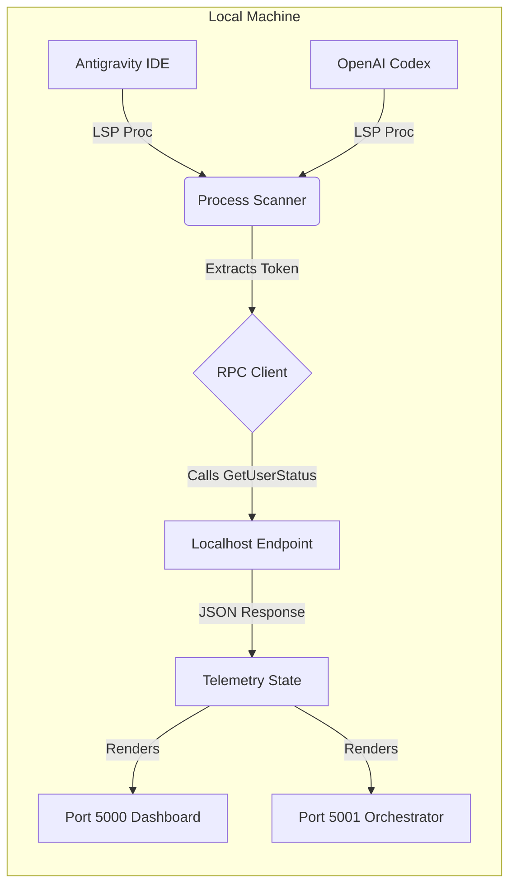

# AI Quota Tracker


A multi-account AI quota and telemetry tracker for Antigravity IDE and OpenAI Codex.

> [!IMPORTANT]
> **Why does this exist?**
> This repository was created in case you are scared of leaking your data or having a third-party extension steal your API quota. This solution is completely free, 100% open source, and runs locally on your machine with absolutely no issues. You are in full control.

## Overview

The `ai-quota-tracker` operates two primary nodes that run seamlessly on your local environment:
1. **Antigravity Tracker (Port 5000)**: A high-density, dark-themed dashboard tracking language server metrics.
2. **Codex Orchestrator (Port 5001)**: A high-density, light-themed workspace manager with a dynamic profile registry.

Both nodes automatically discover active Language Server Protocol (LSP) instances in the background, extract authentication tokens securely, and interface with localhost RPC endpoints to monitor usage quotas natively.

## Architecture



For more in-depth details, please refer to our extended documentation and diagrams:
- **[Architecture Guide](docs/architecture.md)**
- **[API Reference](docs/API.md)**
- **[Architecture Diagram (MMD)](docs/architecture.mmd)**
- **[Profile Lifecycle Flow (MMD)](docs/profile-lifecycle.mmd)**
- **[Release Flow (MMD)](docs/release-flow.mmd)**
- **[Core Workflow (MMD)](docs/workflow.mmd)**

## API & Endpoints

See the detailed [API Documentation](docs/API.md) for endpoint usage and returned data models.

## Installation & Execution

This project uses `uv` for lightning-fast dependency management.

1. **Install dependencies**:
   ```powershell
   uv sync
   ```

2. **Run Antigravity Dashboard (Port 5000)**:
   You can run it directly via the source file with RTK enabled to save agent tokens:
   ```powershell
   rtk uv run python src/antigravity_orchestrator.py
   ```
   *(Or use the installed hook: `rtk uv run antigravity-dashboard`)*

3. **Run Codex Orchestrator (Port 5001)**:
   You can run it directly via the source file with RTK enabled:
   ```powershell
   rtk uv run python src/codex_orchestrator.py
   ```
   *(Or use the installed hook: `rtk uv run codex-orchestrator`)*