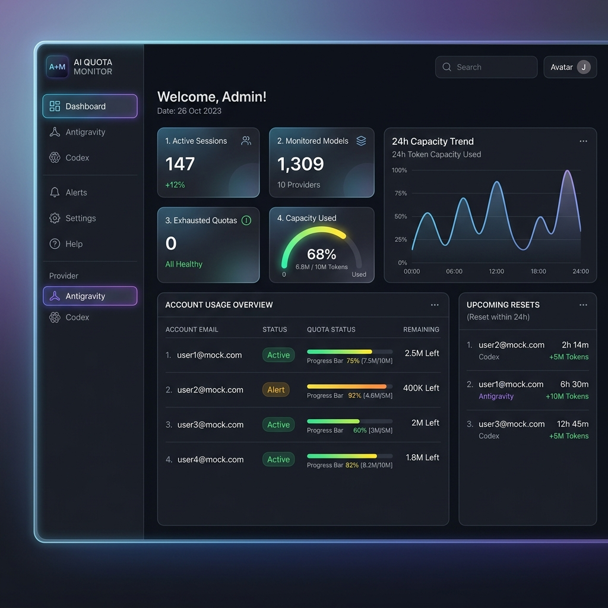
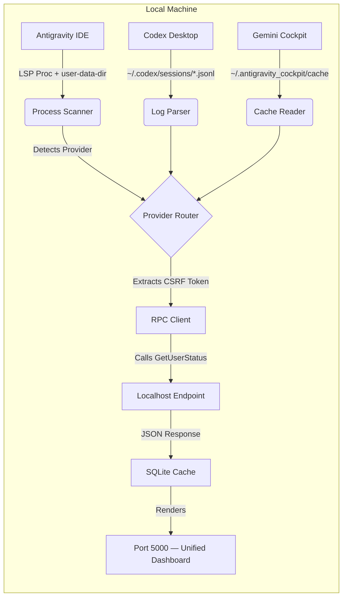

# AI Quota Tracker


A multi-provider AI quota and telemetry tracker — a **single unified dashboard** for Antigravity IDE, OpenAI Codex, and Google Gemini API accounts.

> [!IMPORTANT]
> **Why does this exist?**
> This repository was created in case you are scared of leaking your data or having a third-party extension steal your API quota. This solution is completely free, 100% open source, and runs locally on your machine with absolutely no issues. You are in full control.

## Dashboard Preview



> ↑ Unified dark-themed dashboard showing multi-account quota usage across providers, with per-model breakdowns, capacity trends, and upcoming reset timers.

## Overview

The `ai-quota-tracker` runs a single unified orchestrator on your local machine:

- **Unified Orchestrator (Port 5000)**: A dark-themed, high-density dashboard that auto-discovers all running IDE language server processes, identifies which provider they belong to (via the `--user-data-dir` path), and presents them in a single multi-provider view with per-provider sidebar tabs.
- **Provider detection** is based on the profile directory name (e.g. `AntigravityProfile1`). Adding a new provider is a one-line config change in `src/orchestrator.py`.
- **Persistent offline caching**: Profile data is saved to SQLite so you can see last-known usage even when IDE windows are closed (shown as **Offline**).

The orchestrator automatically discovers active Language Server Protocol (LSP) instances in the background, extracts authentication tokens securely, and interfaces with localhost RPC endpoints to monitor usage quotas natively.

## Supported Providers

| Provider | Source | Multi-Account | Live Tracking |
|---|---|---|---|
| **Antigravity** | LSP process scan | ✅ Yes (isolated profiles) | ✅ Real-time |
| **Codex (OpenAI)** | `~/.codex/sessions` JSONL logs | ⚠️ Single active account | ✅ Last known |
| **Gemini API** | `~/.antigravity_cockpit` cache | ✅ Yes (all cockpit accounts) | ✅ Cache-based |

### Codex Multi-Account Limitation

> [!NOTE]
> **Can we track multiple Codex accounts?**
> OpenAI Codex Desktop logs all activity into a **single global** `~/.codex/sessions` directory with no per-account isolation. It is not possible to distinguish multiple accounts from these logs alone.
>
> **Workaround:** Use isolated Antigravity IDE windows for each Codex account (click "Add Profile" under the Codex tab). The tracker uses Antigravity's `--user-data-dir` isolation to maintain separate sessions and expose the local gRPC port needed for quota tracking. Each window appears as a separate account entry in the dashboard.

## Architecture



For more in-depth details, please refer to our extended documentation:
- **[Architecture Guide](docs/architecture.md)**
- **[API Reference](docs/API.md)**

## API & Endpoints

| Endpoint | Method | Description |
|---|---|---|
| `/` | GET | Serves the unified dashboard HTML |
| `/api/data` | GET | Returns live + cached account data for all providers |
| `/api/history` | GET | Returns the 24h capacity usage history |
| `/api/providers` | GET | Returns the list of configured provider names |
| `/api/launch?provider=Antigravity` | POST | Launches a new isolated IDE profile for the given provider |
| `/api/terminate?pid=<pid>` | POST | Terminates an active language server process by PID |
| `/api/remove_profile?email=<email>&provider=<provider>` | POST | Removes a cached profile from the SQLite database |

## Installation

### Option 1 — PowerShell (Windows) — One-liner

```powershell
irm https://raw.githubusercontent.com/WongYC19/ai-quota-tracker/main/install.ps1 | iex
```

This will automatically:
- Verify Python 3.12+ is installed
- Install `uv` if not already present
- Clone the repository
- Install all dependencies
- Create a `start.ps1` launcher

### Option 2 — Homebrew (macOS / Linux)

```bash
brew tap WongYC19/ai-quota-tracker https://github.com/WongYC19/ai-quota-tracker
brew install ai-quota-tracker
ai-quota-tracker
```

### Option 3 — Docker

```bash
# Using Docker Compose (recommended)
git clone https://github.com/WongYC19/ai-quota-tracker.git
cd ai-quota-tracker
docker compose up -d

# Or plain Docker
docker run -d \
  --name ai-quota-tracker \
  --network host \
  -v "$HOME/.codex/sessions:/root/.codex/sessions:ro" \
  -v "$HOME/.antigravity_cockpit:/root/.antigravity_cockpit:ro" \
  -v "$(pwd)/tracker_history.db:/app/tracker_history.db" \
  -p 5000:5000 \
  ghcr.io/wongyc19/ai-quota-tracker:latest
```

> [!NOTE]
> **Docker & Antigravity LSP:** Live Antigravity session scraping requires `--network host` and process-namespace access, which is Linux-only. On Windows/macOS, run the tracker directly (Options 1–2) for full functionality. Codex + Gemini tracking works inside Docker on all platforms.

### Option 4 — Manual (uv)

```powershell
git clone https://github.com/WongYC19/ai-quota-tracker.git
cd ai-quota-tracker
uv sync
uv run python src/orchestrator.py
```

Dashboard opens automatically at **http://127.0.0.1:5000**

## Gemini API Tracking

The Gemini provider reads quota data directly from the **Antigravity Cockpit** local cache — no additional API keys, tokens, or configuration required.

**Data source:** `~/.antigravity_cockpit/cache/quota_api_v1_plugin/authorized/*.json`

Each JSON file represents one authenticated Google account in the Cockpit. The tracker reads:
- Per-model `remainingFraction` and `resetTime`
- GCP `projectId` association
- **Overage detection** when `remainingFraction ≤ 0`

> [!TIP]
> Gemini data updates whenever Antigravity Cockpit syncs quota info. If the values look stale, open Cockpit and it will refresh automatically.