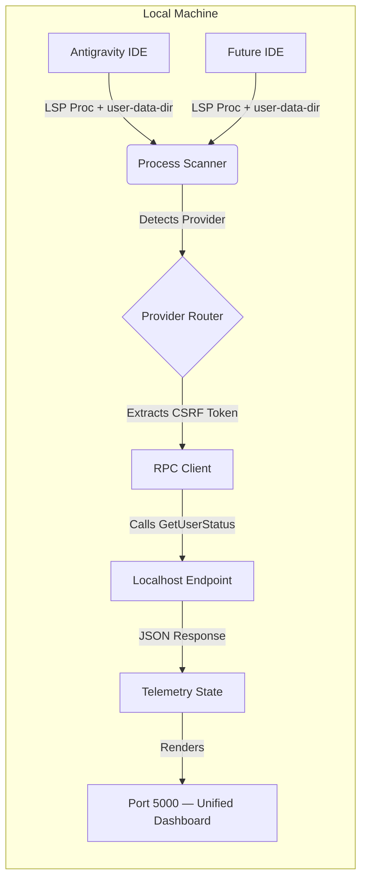

# AI Quota Tracker


A multi-provider AI quota and telemetry tracker — a single unified dashboard for Antigravity IDE and future IDE providers.

> [!IMPORTANT]
> **Why does this exist?**
> This repository was created in case you are scared of leaking your data or having a third-party extension steal your API quota. This solution is completely free, 100% open source, and runs locally on your machine with absolutely no issues. You are in full control.

## Overview

The `ai-quota-tracker` runs a single unified orchestrator on your local machine:

- **Unified Orchestrator (Port 5000)**: A dark-themed, high-density dashboard that auto-discovers all running IDE language server processes, identifies which provider they belong to (via the `--user-data-dir` path), and presents them in a single multi-provider view with per-provider sidebar tabs.
- **Provider detection** is based on the profile directory name (e.g. `AntigravityProfile1`). Adding a new provider is a one-line config change in `src/orchestrator.py`.

The orchestrator automatically discovers active Language Server Protocol (LSP) instances in the background, extracts authentication tokens securely, and interfaces with localhost RPC endpoints to monitor usage quotas natively.

## Architecture



For more in-depth details, please refer to our extended documentation:
- **[Architecture Guide](docs/architecture.md)**
- **[API Reference](docs/API.md)**

## Tracking Codex Desktop Usage

Because the native Codex Desktop application does not expose a local telemetry port (and logs all data globally in a single `~/.codex/sessions` directory), **it is impossible to track multiple isolated Codex accounts natively.**

To solve this, this dashboard tracks "Codex" usage by launching **isolated Antigravity IDE instances** under the hood. Antigravity IDE supports strict browser-level isolation (`--user-data-dir`) and exposes the required local gRPC telemetry ports that this tracker relies on. 

**Requirements:**
- You MUST have Antigravity IDE installed for Codex multi-account tracking to work.
- When you click "Add Profile" under the Codex tab, it will intentionally open an Antigravity IDE window. Use this isolated window to log into your Codex account.
- The dashboard will visually separate your Antigravity-specific accounts from your Codex-specific accounts based on the profile directory name.


## API & Endpoints

See the detailed [API Documentation](docs/API.md) for endpoint usage and returned data models.

| Endpoint | Method | Description |
|---|---|---|
| `/` | GET | Serves the unified dashboard HTML |
| `/api/data` | GET | Returns live account data for all detected providers |
| `/api/history` | GET | Returns the 24h capacity usage history |
| `/api/providers` | GET | Returns the list of configured provider names |
| `/api/launch?provider=Antigravity` | POST | Launches a new isolated IDE profile for the given provider |

## Installation & Execution

This project uses `uv` for lightning-fast dependency management.

1. **Install dependencies**:
   ```powershell
   uv sync
   ```

2. **Run the unified dashboard (Port 5000)**:
   ```powershell
   uv run python src/orchestrator.py
   ```
   *(Or use the installed hook: `uv run ai-quota-tracker`)*

3. **Or use the convenience script**:
   ```powershell
   .\run_agy.bat
   ```